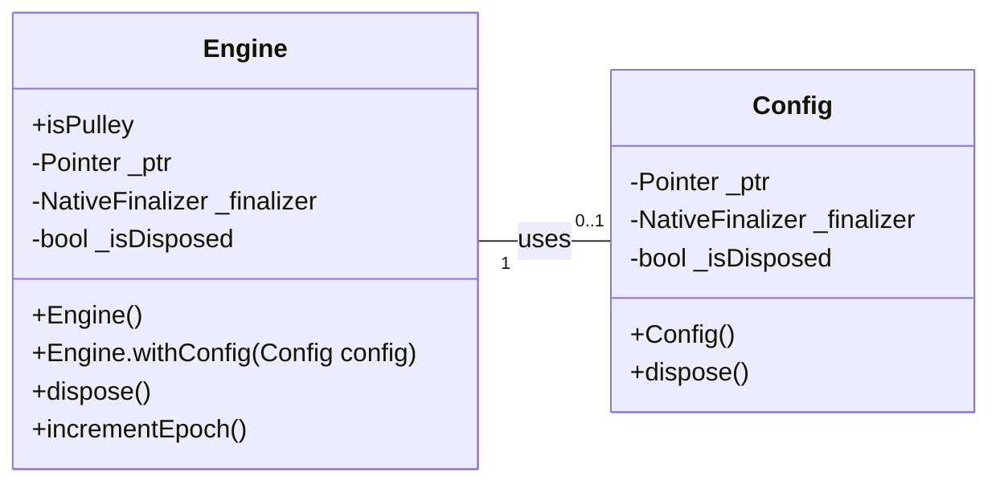

# Wasmtime Dart API Design Document

## 1. Overview

This document outlines the design for building an idiomatic Dart API wrapper for the Wasmtime runtime's C API. The initial focus is on establishing the core `Engine` and `Config` classes, which are fundamental for interacting with Wasmtime. This design aims to provide a Dart-friendly interface while adhering to best practices for FFI (Foreign Function Interface) and resource management in Dart.

## 2. Detailed Analysis of the Goal/Problem

The primary goal is to enable Dart and Flutter applications to embed and execute WebAssembly modules using the Wasmtime runtime. Directly calling the Wasmtime C API from Dart using `dart:ffi` can be verbose, error-prone, and requires careful manual resource management. The problem is to abstract away these complexities and provide a safe, efficient, and idiomatic Dart API that mirrors the ease of use found in Wasmtime's bindings for other languages (e.g., .NET, Go, Python).

The current project is a blank Dart package with a hypothetical API outlined in `README.md` and a limited `ffigen` setup. This design will lay the groundwork for a comprehensive API by focusing on the `Engine` and `Config` components as a foundational MVP.

## 3. Alternatives Considered

*   **Direct `dart:ffi` calls in application code:** This approach would require every developer to manually manage native pointers, call `malloc`/`free`, and handle error codes directly. This is highly discouraged due to increased complexity, potential for memory leaks, and non-idiomatic Dart code.
*   **Using an existing Dart Wasmtime package:** As of now, there isn't a mature, officially supported Dart package for Wasmtime that provides an idiomatic API. The goal of this project is to create such a package.

## 4. Detailed Design for the Modification

### 4.1. FFI Bindings (`tool/ffigen.dart`)

The `ffigen` tool will be used to automatically generate Dart bindings from the Wasmtime C header files. The `tool/ffigen.dart` script will be updated to include all necessary functions for the `Engine` and `Config` classes.

**C Functions to be exposed:**

*   `wasm_engine_new`: Creates a new Wasmtime engine with default configuration.
*   `wasm_engine_delete`: Deallocates a Wasmtime engine.
*   `wasm_config_new`: Creates a new Wasmtime configuration object.
*   `wasm_config_delete`: Deallocates a Wasmtime configuration object.
*   `wasm_engine_new_with_config`: Creates a new Wasmtime engine with a specified configuration.
*   `wasmtime_engine_increment_epoch`: Increments the epoch for epoch-based interruption.
*   `wasmtime_engine_is_pulley`: Checks if the engine is using the Pulley interpreter.

The generated bindings will reside in `lib/src/third_party/wasmtime.g.dart`.

### 4.2. `Config` Class (`lib/src/config.dart`)

The `Config` class will be a Dart wrapper around the native `wasm_config_t` pointer. It will encapsulate the creation and disposal of the native configuration object.

**Design Details:**

*   **File:** `lib/src/config.dart`
*   **Purpose:** Provides a Dart-friendly way to configure a Wasmtime engine.
*   **Constructor:**
    *   `Config()`: Creates a new native `wasm_config_t` using `wasm_config_new`.
*   **Methods:**
    *   `void dispose()`: Explicitly deallocates the native `wasm_config_t` using `wasm_config_delete`.
*   **Internal:**
    *   `Pointer<wasm_config_t> _ptr`: Stores the native pointer.
    *   `NativeFinalizer _finalizer`: Automatically calls `wasm_config_delete` when the Dart `Config` object is garbage collected. This ensures native resources are released even if `dispose()` is not explicitly called.
    *   `bool _isDisposed`: A flag to track if the object has been explicitly disposed to prevent double-free issues.

### 4.3. `Engine` Class (`lib/src/engine.dart`)

The `Engine` class will be the primary entry point for creating and managing a Wasmtime engine. It will wrap the native `wasm_engine_t` pointer and expose high-level Dart methods.

**Design Details:**

*   **File:** `lib/src/engine.dart`
*   **Purpose:** Manages the Wasmtime engine, which is a long-lived object for Wasm compilations.
*   **Constructors:**
    *   `Engine()`: Creates a new native `wasm_engine_t` using `wasm_engine_new`.
    *   `Engine.withConfig(Config config)`: Creates a new native `wasm_engine_t` using `wasm_engine_new_with_config` and the provided `Config` object. This constructor will take ownership of the `Config` object, disposing it after use.
*   **Methods:**
    *   `void dispose()`: Explicitly deallocates the native `wasm_engine_t` using `wasm_engine_delete`.
    *   `void incrementEpoch()`: Calls `wasmtime_engine_increment_epoch`.
*   **Getters:**
    *   `bool get isPulley`: Calls `wasmtime_engine_is_pulley` to check if the Pulley interpreter is in use.
*   **Internal:**
    *   `Pointer<wasm_engine_t> _ptr`: Stores the native pointer.
    *   `NativeFinalizer _finalizer`: Automatically calls `wasm_engine_delete` when the Dart `Engine` object is garbage collected.
    *   `bool _isDisposed`: A flag to track if the object has been explicitly disposed.

### 4.4. Error Handling

Native Wasmtime C API functions typically return `null` pointers or specific error codes on failure. These will be translated into meaningful Dart exceptions (e.g., `WasmtimeException`) to provide an idiomatic error handling experience. For the MVP, we will focus on basic null checks for pointer returns.

### 4.5. Asynchronous Operations

The Wasmtime C API functions for `Engine` and `Config` are synchronous. Therefore, the Dart wrapper methods will also be synchronous. Future API components (e.g., `Module` compilation) may involve asynchronous operations, which will be exposed using Dart `Future`s.

### 4.6. File Structure

*   `lib/wasmtime.dart`: Will export `src/engine.dart` and `src/config.dart`.
*   `lib/src/wasmtime_base.dart`: The existing `Awesome` class will be removed or refactored as it's no longer relevant.
*   `lib/src/engine.dart`: Contains the `Engine` class.
*   `lib/src/config.dart`: Contains the `Config` class.
*   `lib/src/third_party/wasmtime.g.dart`: Generated FFI bindings.

### 4.7. Diagrams

## 5. Summary of the Design

The design focuses on creating a safe and idiomatic Dart API for Wasmtime's `Engine` and `Config` components. It leverages `dart:ffi` and `ffigen` for native interoperability, `NativeFinalizer` for automatic resource management, and clear class structures to encapsulate native details. Error handling will involve translating C API failures into Dart exceptions. This MVP provides a strong foundation for future expansion of the Wasmtime Dart API.

## 6. References to Research URLs

*   [Dart FFI documentation](https://dart.dev/guides/libraries/c-interop)
*   [Dart `NativeFinalizer` documentation](https://api.dart.dev/stable/latest/dart-ffi/NativeFinalizer-class.html)
*   [`ffigen` package documentation](https://pub.dev/packages/ffigen)
*   [Wasmtime C API documentation](https://docs.wasmtime.dev/c-api/)
*   [Wasmtime .NET Engine implementation](https://github.com/bytecodealliance/wasmtime-dotnet/blob/main/src/Engine.cs)
*   [Wasmtime Go Engine implementation](https://github.com/bytecodealliance/wasmtime-go/blob/main/engine.go)
*   [Wasmtime Python Engine implementation](https://github.com/bytecodealliance/wasmtime-py/blob/main/wasmtime/_engine.py)
